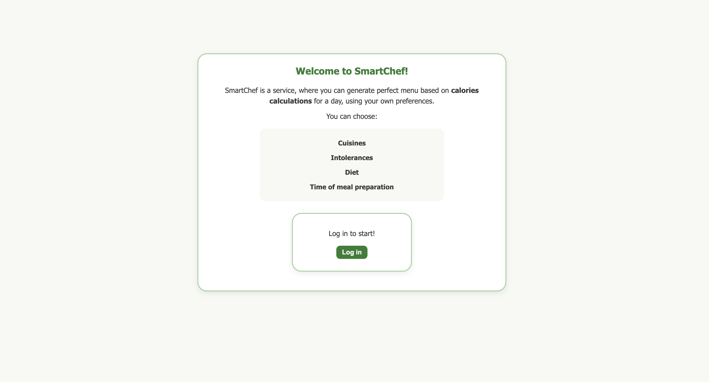
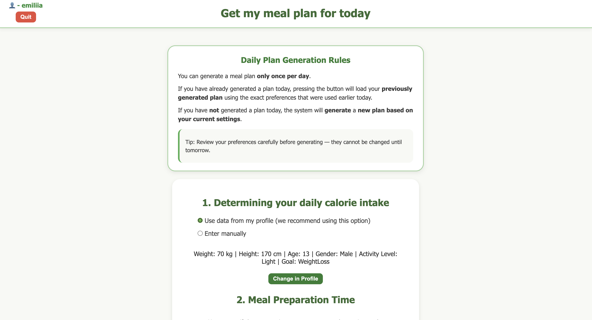
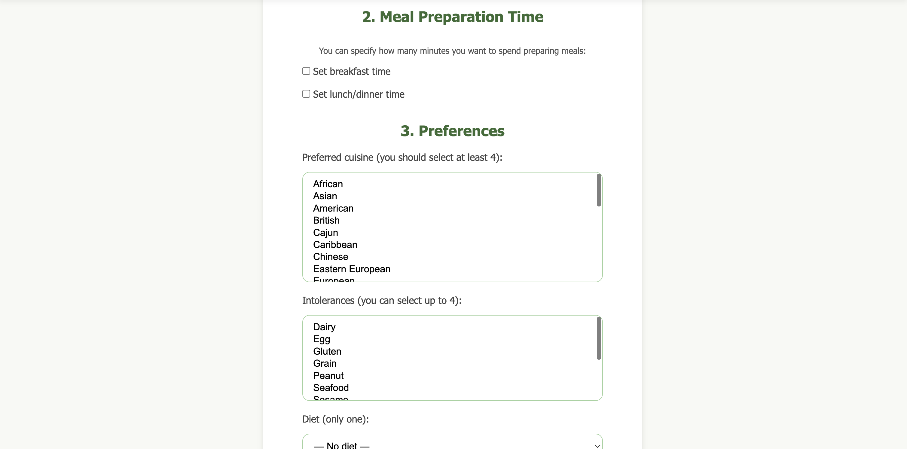
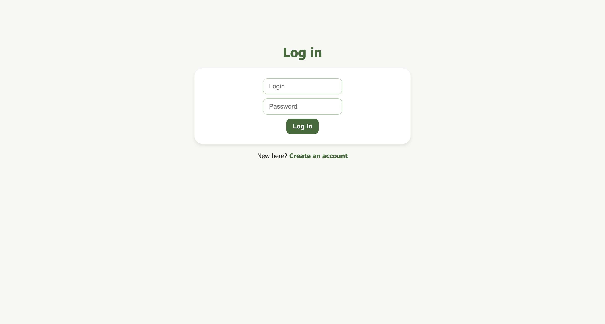
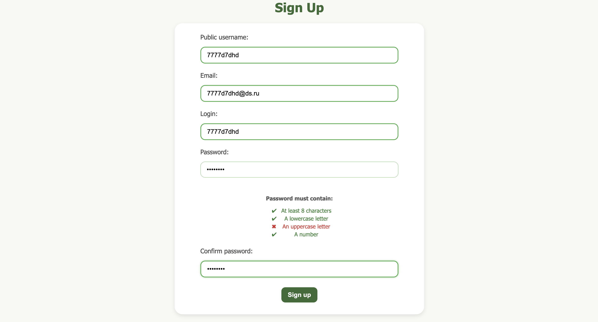
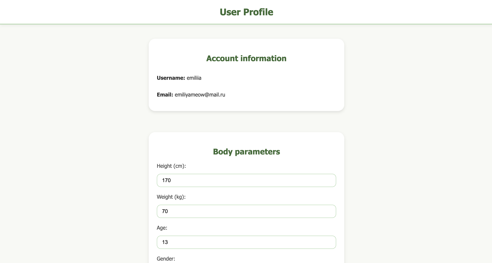
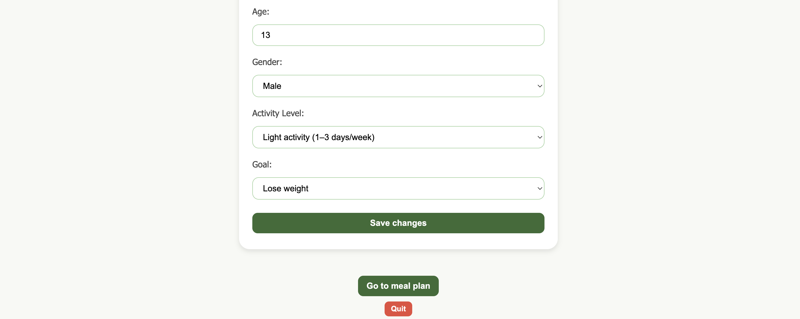
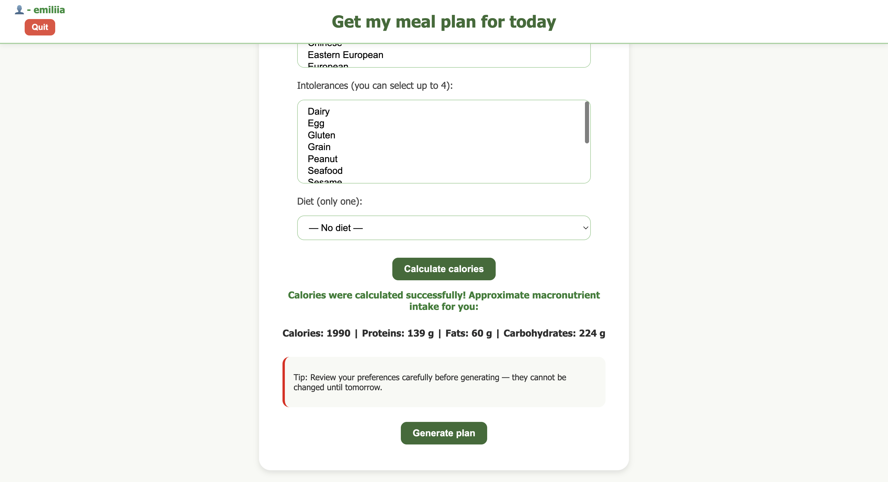
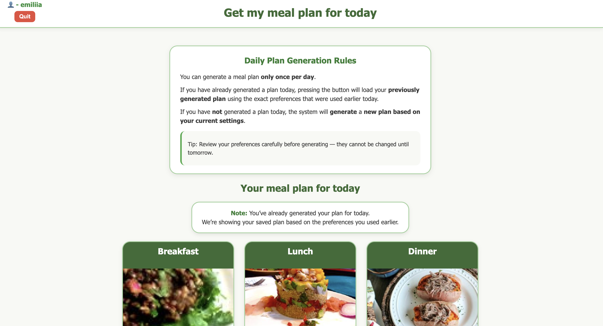
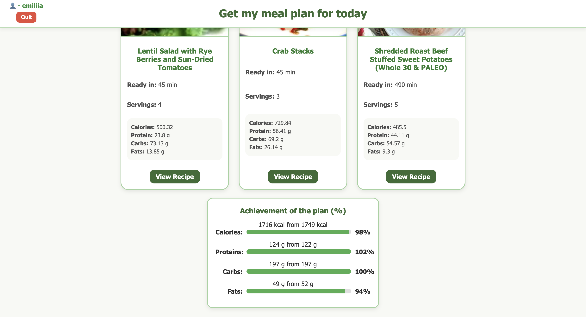

# Smart Chef

## Описание проекта

SmartChef — это web-приложение, которое подбирает персонализированное меню на день с учётом:
- калорийности,
- пищевых предпочтений,
- диет,
- времени, которое пользователь готов потратить на готовку.

Проект реализован на web-сервере на HttpListener с поддержкой маршрутизации, MVC и взаимодействия с PostgreSQL. Для получения рецептов использована Spoonacular API.

|Категория|Технологии|
|---|---|
|Backend|`C#`, `.NET 8` |
|Patterns|`Repository`,`DTO`,`MVC`, `Middleware Pipeline`, `Router`|
|Databases|`PostgreSQL`, `Redis`|
|Frontend|`JavaScript`, `HTML5`, `CSS3`|
|API|`Spooncular API`|

## Для запуска проекта
 - Создать файл appsettings.json, соответствующий файлу appsettings.template.json,
 - Добавить API ключ для подключения к Spoonacular API
 - Добавить username, password для подключения к Postgres.
 - Установить и запустить Redis для хранения сессий пользователей

## Пример работы сайта

Главная страница - /meal_plan

Пользователь не авторизован:

Пользователь авторизован:

Вход

Регистрация

## Информация о пользователе

Вычисление калорий перед генерацией

Полученный план

